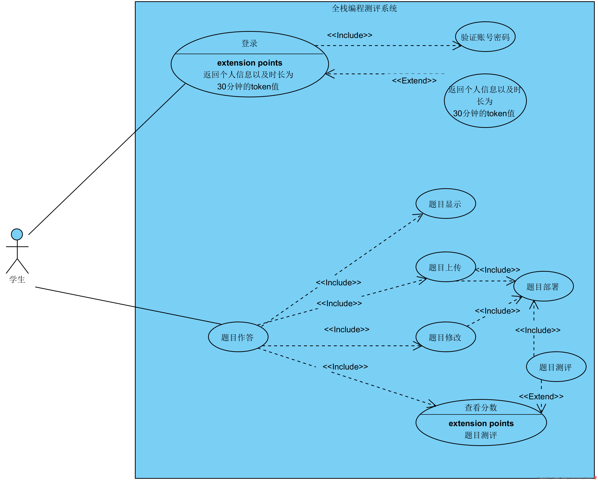
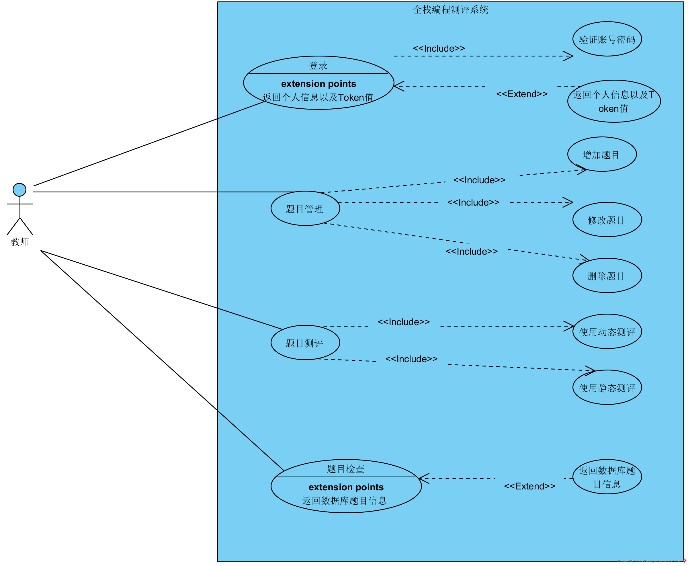

# 论文内容

### 一、摘要

​	当前时代是一个科学、技术与教育相互融合且高速发展的时代，尤其是在计算机相关的领域。随着越来越多的人投身于计算机行业，相关技术也在不断进步。进而，网络教育也在逐渐普及，成为大众的教育方式。同时，受疫情影响，在线教育、在线考试得到了进一步推动和广泛的应用。而在计算机相关专业的在线教学与考试中，编程题目处于尚未完全克服的领域，由于其主观性较强，学生的解题思路和想法各不相同，目前尚缺乏统一的评分标准，不同的题目、不同的代码风格都会影响到成绩的评判。因此，在计算机领域的教学中，编程题目的在线自动评测一直是研究热点和难点。

​	基于以上背景，学者对目前传统的编程题目测评系统进行了深入分析，发现存在一些问题。同时，学者对编程题目的测评特点进行了研究，并结合了人工手动测评的理念，提出了一种编程作业混合式的测评模型。该模型综合了面向结果与面向内容的测评方式，旨在实现对编程题目更全面的测评，以期达到更为合理的测评结果。、

​	本文研究了动态与静态两种方式相结合的测评方式对编程题目进行测评。静态评分部分主要使用字符串比对方式，通过提取题目要求中的关键静态代码，与学生完成的代码进行静态评分比对，根据得分点进行综合测评。动态评分方式部分使用测试用例，通过与标准测试用例的运行结果相比较，得到最终动态结果得分。两种评分方式在经过用例大量测试后，表现出令人满意的结果。同时，本系统使用了软件工程的设计思想进行开发，对各层次之间的功能做了详细的区分与隔离，保证了系统的高内聚低耦合性，充分展现了系统的功能。

### 二、绪论

##### 2.1	研究背景与意义

​	自20世纪以来，计算机和互联网行业迅猛发展，各类网站和计算机软件逐渐渗透到人们生活的各个领域。这种变革在一定程度上不仅丰富了人们的生活，也改变了其方式，其技术涉及的综合性与现代学科产生了深度的交汇。随着整个社会对计算机相关专业人才的需求不断增加，各个热门的互联网技术交流平台愈加热门，越来越多的人表现出对计算机编程技术的浓厚兴趣。由于计算机软件的综合性，各行各业的企业利用管理软件进行内部管理，通过改进算法提高企业竞争力。在社会生产和各企业单位中，计算机技术的应用正变得日益普及，高精尖的计算机领域技术也不断投入到国家的军事领域，深刻影响着一个国家的军事实力。在未来发展规划中，特别是在十四五规划中提到了人工智能、大数据等计算机技术的发展计划。对于社会和国家而言，计算机技术的持续发展显得至关重要，而对于高校而言，普及推广计算机相关知识的普及至关重要。

​	软件测试在软件开发过程中具有重要的意义。通过系统性的测试，可以有效发现和纠正潜在的软件缺陷和错误，提高软件的稳定性、可靠性和安全性，从而保障最终产品的质量。主要的软件测试方法有人工测试与自动化测试两种，与人工测试相比，自动化测试具有更明显的优势：自动化测试可以更快速地执行测试用例，尤其是在大型项目或需要频繁重复测试的情况下，它提高了测试效率，使得软件的迭代开发过程更加迅速；自动化测试消除了人为因素，减少了测试过程中的误差。测试脚本按照预定义的规则和标准执行，提高了测试的准确性；自动化测试可以轻松地覆盖大量的测试用例，包括对系统的各个部分进行综合测试，确保软件的全面性和稳定性。

​	现有的考试系统为同学们提供了一个自我测评的途径，鼓励他们积极参与实践，提升自身的开发能力。由于编程涉及到个人逻辑性和思维习惯，很多问题只能通过运行结果来评价。然而，这种评价方式存在不公平的问题，因为多种因素可能导致运行结果不尽如人意，尤其是在编写程序时很小的差距可能导致效果大不相同。因此，为了客观、全面地评估考生的编程能力，开发一套能够分步评分的系统显得非常必要。

##### 2.2	国内外研究现状

​	上世纪60年代，美国率先推出自动化阅卷的考试系统，尽管当时仅适用于单选题、判断题等客观性题目的自动评分。在1970年代，美国提出了如何通过计算机而非传统纸质形式进行考试的问题，并展开相关研究。1983年，美国首次尝试实施计算机模拟考试，尽管此时仍处于辅助传统考试的阶段。1990年代初，多个州开始制定相互承认的标准，为计算机考试的广泛发展奠定基础。过去三十年，考试系统经历了不断专业化的演进，包括专门针对英语的在线考试（如托福、雅思）以及专注于计算机等级考试。自动化阅卷在上世纪60年代的基础上迎来了新的发展，尤其是一些算法，例如基于K-Shingling的相似度计算。

​	如今，随着计算机教育在我国广泛的普及，大部分高校已经舍弃了使用纸质教材进行考试的传统考试方式，转为在线编程测评考试；各大企业招聘时，同样不仅仅局限于基于简历内容以及简单计算机基础的提问，更倾向于使用在线编程测评软件现场进行测评。国内外已经有比较多的线上编程能力测评系统的开发，比如国内较为出名的牛客网、ACMCoder、北森测评等，国外也有例如Leetcode、HackTheBox等在线测评系统。这些系统经过优秀的团队花费大量时间研究和开发，可以供一些大型的编程比赛的测评使用，也能够作为学生练习自己的编程能力进行评估来使用。

##### 2.3	论文研究目标与研究内容

​	2.3.1研究目标

​			本系统将传统的用例测试与编程题目代码得分点提取方式相结合，使得整个测试过程中既包含了静态测试的准确性，同时结合了动态评分的广泛兼容性。总体希望测试结果更加合理，反馈给老师同学的得分结果更加符合预期。在减少教师手动下载源码评分的复杂性的同时，也降低了评分周期(即从学生提交作业到得到分数的时长)的长度，提高了老师和学生的学习效率。

​	2.3.2研究内容

​			1、通过文献调研的研究形式，了解了在线测评系统的现状。在系统开发前期，对市面上较为常见的测评系统进行详细的体验，例如牛客网、力扣网等大型测评平台，充分了解到国内在线考试系统的现状。根据网络中现有的资料，掌握目前大多数在线考试系统判分思路、实现技术等。同时询问学生以及教职人员，询问对测评系统的基本预期与开发建议，根据询问结果确定了系统开发方向以及主要功能点，为全栈测评系统的开发打下了坚实的基础。

​			2、在明确主要需求后，确定了系统总体采用MVC设计模式。该设计模式旨在分离应用程序的内部表示（Model）、用户界面（View）和应用程序的处理逻辑（Controller）。通过将应用程序分为这三个部分，将请求分布到不同的模块中，利用模块之间的互相服务，使得各部分之间的耦合度降低，提高了应用程序的可维护性和可扩展性。

​			3、根据需求、架构设计以及如今常用的技术选型，确定了主要使用SpringBoot + Vue + Redis + Mysql的前后端分离技术作为整体的技术框架。使用前后端分离技术，使得代码更易于维护。前端和后端的代码分离清晰，每个部分都专注于自己的功能，不会影响到另一个部分，也更容易理解和调试。同时可以根据需求独立开发和测试，API接口进行集成，有利于今后的部署与维护。

​			4、系统后端数据库相关操作主要使用了Mybatis与Mybatis-plus相结合进行使用。作为后端与数据库常用的框架，MyBatis通过XML或注解的方式将Java对象与数据库中的记录进行映射，使得开发过程中，能够使用面向对象的方式操作数据库，避免了传统JDBC中的繁琐的SQL拼接和结果集处理。Mybatis-plus为Mybatis的扩展，封装了丰富的数据库CRUD操作，增强了Mybatis的实用性，减少了大量非规范代码的入侵。

​			5、本系统以编程题目测评为核心，针对编程题目测评，本文提出了使用“中间文件”的测评方法。该方法弥补了现有系统中只能使用黑盒测评，即使用传统用例测试的局限性，防止被测对象使用特殊处理，强制输出期望答案的情况。在学生上传作业到服务器后，服务器主动执行Shell脚本，根据老师上传到中间文件，提取出学生作业中的相应答案文件，与标准答案进行字符串比对后，实现打分的目的。根据测试结果，有针对性的帮助学生找到薄弱点，加强相关方面的学习。

​			6、在系统编写过程中，对于每个完成的模块，及时进行了模块化的单元测试。在系统完成后，对整体进行了集成测试。从稳定性、兼容性、流畅度、性能、功能各个角度，设计测试用例，保证系统的正确使用。

##### 2.4论文组织结构

​	本文的组织结构如下：

​	第一章：绪论部分。在该部分中，阐述了如今计算机教育的时代背景，确定了在当今复合型社会中，越来越多的学科将直接或间接的使用到编程来提高工作效率，设计并实现自动评分系统的重要性。查找并收集国内外自动评分系统的研究现状，分析出自动评分系统的进展与不足。简单介绍了论文的研究目标以及具体的研究内容，针对目前全栈编程题目自动测评系统的薄弱点，本文作者通过学习、研究其他测评系统，结合全栈语言的语言特点，提出了使用”中间文件“的自动评分方法这一创新点。

​	第二章：相关技术及理论简介。本系统使用了前后端分离式架构，前端使用的技术为Vue，为目前企业中主流的前端框架，同时结合Element-UI手脚架，实现了快速搭建系统，也兼顾了系统界面的美观。后端使用了SpringBoot，同样也是较为成熟以及常见的后端服务开发框架。服务器以及数据库分别使用了Tomcat和Mysql，免费以及高性能使其成为微小项目的首选。最后说明了前期调研情况的反馈结果。

​	第三章：系统需求分析。本章对全栈编程测评系统进行了大体分析，并对系统的设计，实现过程中的技术，部署的人力，设备租赁的经济开销以及社会需求度等可行性进行具体分析，并着重使用用例图分析了功能技术可行性。

​	第四章：系统设计。本章基于完成系统可行性分析以及需求分析后，进行系统总体架构方面的的规划，根据常见的软件工程设计模式，梳理出系统的层次结构。对于每个层次，合理规划出教师模块、学生模块、评分模块、通用模块的时序图，形象展示了每一个请求背后的处理过程，也梳理清模块之间的调用情况。使用ER图，简述整个系统实体之间的关系。之后分别对每个数据库表进行具体的设计说明。在前面各项工作顺利完成的基础上，实现概念设计与逻辑结构实现。

​	第五章：系统实现。本章中大量使用源码，对每段关键的业务逻辑代码进行逐条解释，并通过具体例子说明代码如何处理数据，得到正确的返回结果。

​	第六章：系统测试。首先对系统进行了集成测试，即保证系统能够正常的运行需求。然后对于系统的主要功能，包括登录、增删改查作业、成绩查询等进行功能性测试，列举测试用例以及对应的测试结果。最后，对非功能性进行测试，为系统稳定运行提供保障。

​	第七章：总结与展望。对整个毕业设计，从选题到设计，再到实现与测试进行总体的回顾，总结工作中出现的问题，如何发现，如何解决。以及遗留的问题，期望在之后的开发过程总能够对系统进行进一步完善与优化。

2.6本章小结

​	本章首先对研究背景进行了阐述，经过前期调研工作以及对市场中常见的系统测试，外加国内外研究现状，总结出了全栈测评系统的发展与问题。简单说明了论文的研究目标与解决的实际内容，完成系统使用的技术栈，系统的总体设计等相关内容。最后对论文的框架进行了介绍，方便读者了解论文的大体内容。

### 三、相关理论与技术介绍

​	3.1前端网页技术——Vue

​		Vue是一款渐进式JavaScript框架，其设计之初的目的为专注于构建用户界面。 Vue的核心库只有几十KB大小，使得页面加载速度快，结合响应式数据绑定机制，大大减少了手动操作DOM的繁琐工作。同时，市面上含有大量基于基于Vue框架实现的前端模板，如：Element-Ui、iview-admin，用户可以简单修改模板，完成项目前端开发。在与后端交互方面，Vue提供了如Vue-resource、Fetch、axios等类库，通过发送请求到后端，将前后端业务进行分隔，提高效率。Vue总的来说，Vue.js是一个简单、灵活、高效的前端框架，它能够帮助开发者快速构建交互式的Web应用，并且在性能和体验上取得良好的平衡。

​	3.2后端框架技术

​	3.2.1SpringBoot

​			Spring Boot是一种基于Spring框架的快速开发、简化配置的框架，它使得开发者可以更加快速地搭建和部署Spring应用程序。所谓Spring，是目前较为流行的后端开发框架，其核心思想为面向切面编程和控制反转，通过使用工厂设计模式，使得开发人员不用自己创建繁琐的类，只用调用工厂类即可。然而，Spring其中包含大量的配置文件，需要用户创建XML进行配置，比较繁琐。Spring Boot通过提供自动配置、起步依赖、嵌入式Web服务器等功能，大大简化了Spring应用程序的开发和部署过程。它采用了约定大于配置的理念，通过默认配置和自动装配，减少了繁琐的配置工作，同时也提供了一套强大的开发工具和插件，使得开发者能够更加专注于业务逻辑的实现，因此受到了广泛的欢迎和应用。

​	3.3数据库技术

​	3.3.1Mybatis与Mybatis-plus

​			MyBatis是一个基于Java的持久层框架，它通过简化数据库操作的方式，帮助开发者更轻松地与数据库交互。MyBatis通过XML文件或注解配置SQL语句，并提供了一套映射机制，将数据库记录映射成Java对象，使得开发者可以使用面向对象的方式操作数据库。MyBatis-Plus是在MyBatis基础上的增强工具包，它提供了一系列增强功能，简化了MyBatis的使用。MyBatis-Plus提供了便捷的代码生成器、Lambda查询、分页查询、多租户支持等功能，使得开发者可以更加高效地进行开发。简而言之，Mybatis简化了开发人员访问数据库的复杂性，但还需手动编写SQL，而Mybatis-plus自动生成大量SQL语句，开发人家只需按需调用即可。

​	3.3.2数据库选型

​			本系统使用MySQL作为数据库进行数据管理。在系统运行过程中，涉及大量的数据变换，MySQL作为一种开源的关系型数据库管理系统，被广泛应用于Web开发和数据存储领域。它具有稳定可靠、易于使用、高性能和安全性等特点，适用于各种规模的应用程序，并拥有庞大的社区支持和生态系统。同时支持事务、以及MVCC的特性使得MySQL在保证数据一致性上具有较好的表现。在缓存方面，本系统使用了Redis作为缓存数据库。由于Redis基于内存的特性，使其处理访问时十分高效。利用Redis缓存token值，是目前较为常见的解决Session无法跨服务器的方式之一。

​	3.4服务器部署

​		本系统中，需要对学生上传的全栈Web 应用程序归档文件进行自动部署，以及对学生的源代码进行字符串匹配。因此，选择Tomcat服务器作为文件部署服务器。首先，Tomcat服务器开源免费下载和使用，并且以在多种操作系统上运行，具有很好的跨平台性。其次，Tomcat服务器提供了远程管理发API接口，可以通过URL请求对Webapps下的文件进行自定义部署。而后台服务器端选择使用CentOS 7，基于Red Hat Enterprise Linux源代码构建而成，提供了稳定可靠的操作系统环境，并使用Shell脚本对学生源代码进行了过滤，提取关键得分点，实现了静态评分的方式。

​	3.5相关测试理论

​		白盒测试：基于源代码的测试方法，测试人员可以查看和了解被测试软件的内部结构、逻辑和实现细节。可以发现和解决代码中的逻辑错误、边界条件错误等问题，能够提高软件的质量和稳定性，但是需要深入了解代码，测试过程相对复杂，且可能忽略了用户体验和外部环境等因素。

​		黑盒测试：基于软件功能和用户需求的测试方法，测试人员不需要了解软件的内部结构和实现细节，而是从用户的角度出发进行测试。测试过程相对简单，可以快速进行测试并发现用户体验和功能方面的问题。相应的无法发现代码中的逻辑错误和边界条件错误，只能验证软件是否符合预期的功能和需求。

​		通常会结合使用白盒与黑盒测试，以便全面地测试软件的质量和稳定性。

​	3.6本章介绍

​		本章主要介绍了系统实现过程中，使用到的技术。从前端的Vue到后端的SpringBoot，再到主要完成测评功能的服务器，简单阐述了了解本系统应有的技术。

### 第四章、系统分析

​	4.1 全栈编程测评系统整体需求

​		在当前的教学环境中，教师主要依赖手动评分方法来对学生作业进行评估。这种方式存在着效率和准确性方面的挑战，受到各种因素的影响。相比之下，自动评分系统具有简单稳定的特点，可以有效解决一些评分效率方面的问题。但是，现有的自动评分系统通常采用黑盒测试的方法，即仅依赖于与测试用例进行比对来进行评分，无法涵盖所有可能的情况，对于特殊情况缺乏特殊处理的能力。因此，本系统使用了白盒与黑盒测试相结合的方式，使测评过程中兼顾结果与过程，降低了突发情况的错误率，提升了判分的效率，让老师能更投入到教学工作中。同时，系统界面美观且直接，减少了用户的适应时间，吸引同学使用，方便总结与学习。

​	4.2 系统可行性分析

​	4.2.1 技术可行性

​			本系统使用了两种测试方式，即黑盒与白盒测试，下面对两个测试技术进行分析。首先为黑盒测试，需要解决的主要问题为如何将学生上传的WAR包进行自动部署。Tomcat服务器提供了Manager App 接口，允许用户使用请求指定WAR包的位置以及部署的相对路径。充分该接口即可完成WAR包部署并成功访问。其次为白盒测试，涉及到对学生源代码进行审核。因为学生会将压缩包上传到Linux服务器，因此，使用Linux中的Shell脚本即可实现对压缩包的批处理工作。前后端分离网站搭建思路以及SpringBoot+Vue的组合框架已经较为成熟，完全可以满足本系统的需求。同样Redis+MySQL的数据处理方式也是当今最常见的解决方案，保证了数据的安全性与系统的易用性。因此本系统具备技术可行性。

​	4.2.2 经济可行性

​			本系统所使用的前后端技术框架、数据库、服务器等资源皆是完全开源免费，可以通过官方网站进行下载。而在系统部署运行时，前端利用Node.js中的npm进行包管理，实现一键安装部署，后端既可以使用本机与虚拟机组合部署，也可以部署到各大厂商提供的云服务器中，可以适用不同需求，具备经济可行性。

​	4.2.3社会可行性

​			本系统意在创建一个简单高效的编程测评系统，减少老师的工作压力以及调动学生的学习热情，提升了学生的学习效率，不存在对学生以及老师的人身、精神方面造成威胁的因素。所以该系统具备社会可行性。

​	4.3系统功能性需求分析

​			本段对系统中两种主要使用人群的功能需求进行了分析，分别为学生模块功能分析，包括对作业的上传修改；老师模块分析，对作业进行白盒黑盒测试，对作业的增删改查，查看作业完成情况。

​	4.3.1学生模块功能需求分析

​			在学生进入系统首页后，使用学号与密码进行登录，在登录之后，后端返回时长为30分钟的Token值，该值保证学生在30分钟内无需再次登录，节省时间。登录页面后主要为题目呈现与作答模块。如下图所示

在学生登录系统后，系统查询数据库，返回作业列表并显示学生完成情况。学生根据题目要求，提交相应文件。待老师端对作业进行测评后，学生可以得知作答结果并根据成绩规划复习重点。

​	4.3.2教师功能模块需求分析

​			教师模块中，同样包含了登录模块，减少重复登录的不必要。在教师模块中，还包含了题目测评、题目检查、题目管理这三个模块，如下图所示

​			题目管理模块：教师角色在进入系统后，可以对系统中题目进行编辑，新增题目，修改题目，删除错误题目等。

​			题目检查模块：在题目检查模块中，教师可以查询每个题目的完成情况、为完成人员以及每个人的分数情况，及时督促学生完成作业。

​			题目测评模块：教师可以使用该模块提供的两种测评方法，动态测评与静态测评，对学生所完成的作业进行全方面的评分，评分结果将显示在题目检查模块中。

​	4.4非功能需求分析

​	4.4.1 可扩展性

​			在系统设计中，采用了分层设计的思想，各个模块之间通过请求服务的形势进行数据传递，在今后的运行过程中，如果需要对系统增加功能点，只需新增接口或服务即可，保证了系统 对扩展开放,对修改关闭。

​	4.4.2规范性

​			系统中的变量、方法、以及类名都遵循了开发规范，同时对核心代码进行了注释，方便其他开发人员在后续调试过程中了解系统各模块的实现逻辑。

​	4.5本章小结

​			本章首先对全栈编程测评系统进行了总体分析，描述了系统的主要功能点，之后对从技术、经济、社会等方面，分析了系统实现的难度与价值。在之后，对测评系统中的每个模块做了阐释与说明，保证在实际编码之前，理清系统思路和实现过程。